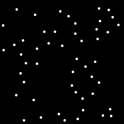
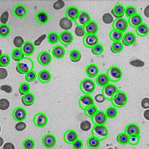
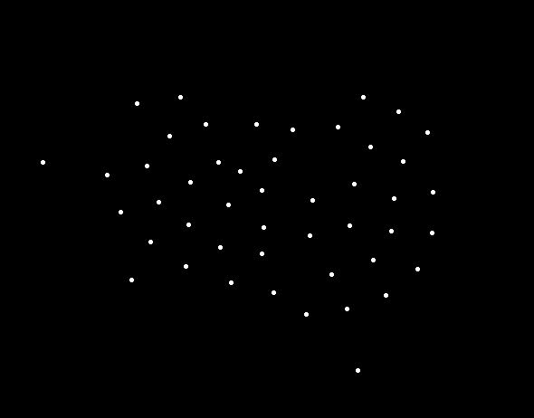
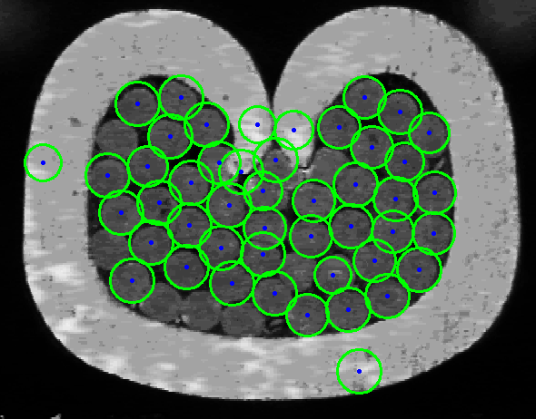
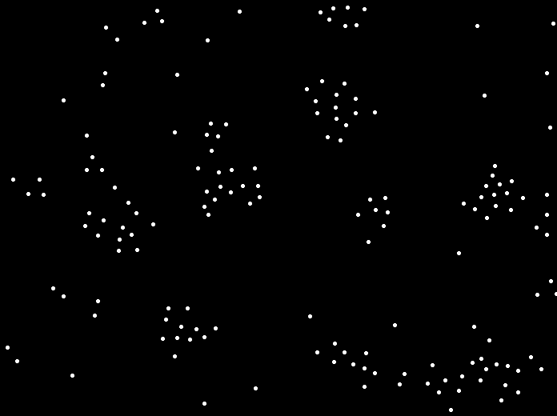
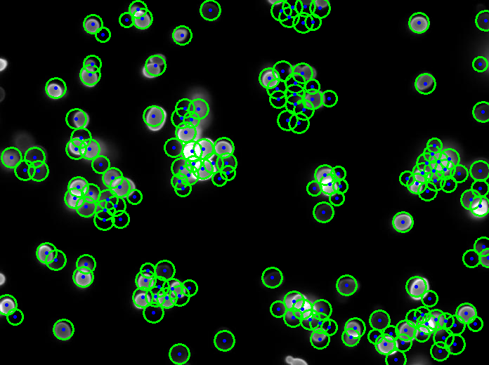

# Hough Transform for Circles

This Python script implements Hough Transform with Canny edge detection for detecting circles. The algorithm can be used to find circular objects in images.

## Algorithm Overview

1. **Sobel Filter:** The input image is filtered using the Sobel operator to detect edges.

2. **Non-Maximum Suppression:** The edges are thinned using non-maximum suppression, which helps identify the most prominent edges.

3. **Double Thresholding:** The edges are categorized into strong, weak, and non-edges by applying double thresholding.

4. **Hysteresis:** Edges are finalized by tracing along the strong edges and connecting weak edges if they are adjacent.

5. **Circle Detection:** The algorithm finds circles based on the accumulated votes and a specified vote threshold.

6. **Visualization:** The script includes functions to draw detected circles and their centers on the original image.

## Usage

To run the script, provide the following command-line arguments:
- `<image_path>`: Path to the input image.
- `<min_radius>`: Minimum radius of circles to detect.
- `<max_radius>`: Maximum radius of circles to detect.
- `<gaussian_kernel_size>`: Size of the Gaussian blur kernel for preprocessing.
- `<vote_threshold>`: Minimum vote count for a circle to be considered a valid detection.

## Example

Here is an example command to run the script:

```bash
python hough_transform_circles.py input/circles.png 14 16 7 25
```


## Output

The script produces the following results:

- **Accumulator Image:** A visualization of the Hough Transform accumulator, showing potential circle centers.

- **Hough Transform for Circles:** The original image with detected circles drawn in green with their centers.

 <br>
 <br>
 <br>


